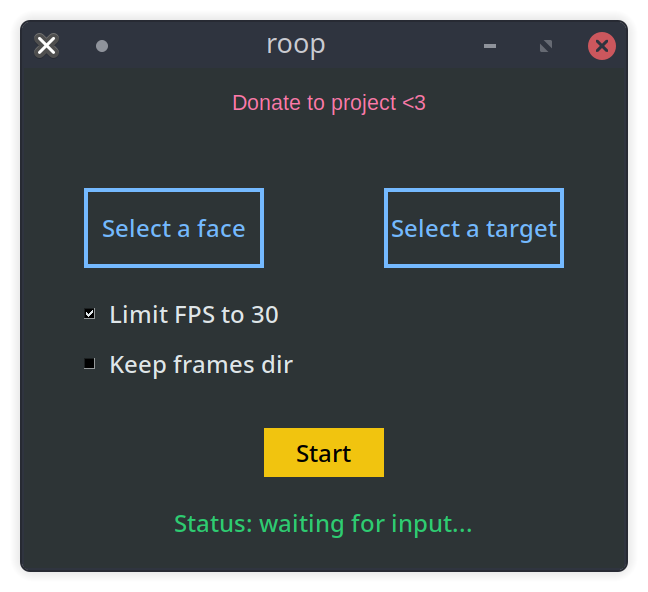

git clone https://github.com/YINYIPENG-EN/AI_face_swap.git

可直接选择一张人脸去替换另一张图片或者视频中的人脸。本项目仅提供人脸替换部分，不需要数据集，不用训练！

# 项目说明

本项目参考源码：https://github.com/s0md3v/roop

因上述代码在实际使用中有些问题，因此本人原项目代码中做出了调整，可以在低版本的torch以及低算力的硬件上使用，支持windows环境中使用。

部分项目资源我将会上传至我的云盘供大家下载。

换脸后的**人脸图片质量还是比较模糊的**，所以大家仅供娱乐学习即可。

# 环境说明

numpy>=1.21.6
opencv-python==4.7.0.72
onnx==1.11.0
insightface==0.7.3
psutil==5.9.5
tk==0.1.0
pillow>=9.1.1
torch>=1.7.0
onnxruntime-gpu==1.6.0

cuda:10.2

windows 10

onnxruntime-gpu要和自己的cuda版本对应

下面可以给出效果图。拿我喜欢的斗破苍穹为例，将云昀的脸换到美杜莎女王脸上。


# 准备工作

1.将inswapper_128.onnx权重放在目录下。

2.将buffalo_l.zip下载后解压至models文件下。

> models/
> |-- buffalo_l
> |   |-- 1k3d68.onnx
> |   |-- 2d106det.onnx
> |   |-- det_10g.onnx
> |   |-- genderage.onnx
> |   `-- w600k_r50.onnx

3.找到core/config.py，修改第12行人脸检测权重路径。我这里是F盘的roop。所以我的**buffalo_l**存放在F:/roop/models/下。

```python
FACE_ANALYSER=insightface.app.FaceAnalysis(name='buffalo_l',root='F:/roop/',providers=core.globals.providers)
```

4.ffmpeg安装。将ffmpeg-6.0-full_build.7z解压，将bin下的ffmpeg.exe添加至环境变量。将然后将ffmpeg.exe复制一个到你pytorch环境下【和torch下的python在一个目录中即可】

权重路径：

链接：https://pan.baidu.com/s/1NT26HwXyjqdbjiJSbjGYjg 
提取码：yypn

# 如何使用

```shell
python run.py
```

如果是想用用GPU

```
python run.py --gpu
```

然后会出来一个GUI界面。



Select a face 是用来选择source人脸的【仅支持图片】，Select a target是要替换的人脸【支持图片和视频】。然后点击Start即可

程序运行的时间和你硬件以及内存有关系，所以耐心等待。如果你的硬件环境比较差，可能会意外退出。

视频检测会限制在30FPS【够用了】。


# 免责声明

比这个更好的deepfake软件已经存在，这只是我为学习人工智能而创建的一个爱好项目。用户应该使用这个程序来学习编程并真诚地使用该软件。用户在使用自己的脸之前必须征得相关人员的同意，并且在网上发布内容时不得隐瞒这是一个深度伪造的事实。我不对最终用户的恶意行为负责。

Better deepfake software than this already exist, this is just a hobby project I created to learn about AI. Users are expected to use this program for learning programming and using the software in good faith. Users must get consent from the concerned people before using their face and must not hide the fact that it is a deepfake when posting content online. I am not responsible for malicious behaviour of end-users.